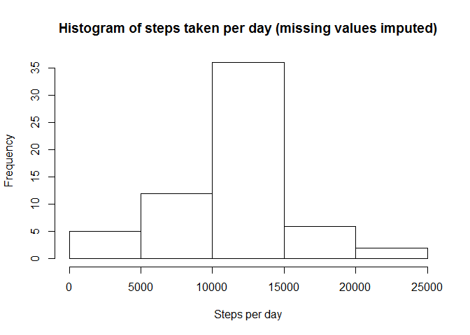

# Reproducible Research: Peer Assessment 1


## Course project 1

### Introduction
This project will look at answering some questions arising from the "Activity monitoring" dataset. In each instance the question will be given with the answer and code.


### Loading and preprocessing the data
Firstly the data has to be imported into R. A seperate dataset will be created which contains no missing values

```r
# 01 Load the data
all_data = read.csv(unz("activity.zip", "activity.csv"))

# 02 Transform data to usable format/layout
data_nomiss = subset(all_data, steps != 'NA')
```

### What is mean total number of steps taken per day? 
Now the dataset with no missing values will be used.


```r
# 01 Calculate the total number of steps taken per day
steps_per_day = sqldf::sqldf("
    select
        date
        ,sum(steps) as total_steps
    
    from data_nomiss
    group by
        date
")
```

```
## Loading required package: DBI
```

```
## Loading required package: tcltk
```

```r
# 02 Make a histogram of the total number of steps taken each day
hist(steps_per_day$total_steps
     ,main = "Histogram of steps taken per day"
     ,xlab = "Steps per day")
```

<!-- -->

```r
# 03 Calculate and report the mean and median of the total number of steps taken per day
nomiss_daily_mean = mean(steps_per_day$total_steps)
nomiss_daily_median = median(steps_per_day$total_steps)
```

The following table gives the mean and median of steps taken per day:

Measurement|Value (steps taken per day)|
-----------|---------------------------|
Mean       |1.0766189\times 10^{4}
Median     |10765


### What is the average daily activity pattern?


```r
# 01 Make a time series plot...
avg_steps_per_interval = sqldf::sqldf("
    select
         interval
         ,avg(steps) as avg_steps
     
     from data_nomiss
     group by
         interval
")

plot(avg_steps_per_interval$interval
     ,avg_steps_per_interval$avg_steps
     ,type = "l"
     ,main = "Average number of steps taken per inverval"
     ,xlab = "Daily interval"
     ,ylab = "Average steps")
```

<!-- -->

```r
# 02 Which 5-minute interval, ... , contains the maximum number of steps?
max_steps = subset(avg_steps_per_interval, avg_steps == max(avg_steps))
```

The 5 minute interval which contain the most steps, is interval **835** with a total of **206** average steps.


### Imputing missing values
Up to now missing values have been excluded. Since missing days' data can introduce bias in the analysis, these values will be replace/imputed with other values.


```r
# 01 Calculate and report the total number of missing values
data_miss = nrow(all_data[is.na(all_data$steps),])
```

There are **2304** missing values in the dataset. The interval mean will be used to replace these values as this is a reasonable replacement.


```r
# 03 Create a new dataset that is equal to the original dataset but with the missing data filled in
new_data = sqldf::sqldf("
    select a.*
        ,b.avg_steps
        ,b.interval as interval2
        ,case
            when a.steps is null then b.avg_steps
            else a.steps
        end as new_steps

    from all_data a
        left join avg_steps_per_interval b
            on b.interval = a.interval
")

# 04 Make a histogram of the total number of steps taken each day and ...
steps_per_day_new = sqldf::sqldf("
    select
        date
        ,sum(new_steps) as total_steps
    
    from new_data
    group by
        date
")

hist(steps_per_day_new$total_steps
     ,main = "Histogram of steps taken per day (missing values imputed)"
     ,xlab = "Steps per day")
```

<!-- -->

```r
all_daily_mean = mean(steps_per_day_new$total_steps)
all_daily_median = median(steps_per_day_new$total_steps)
```

Now compare the average steps taken per day between the dataset where missing values were excluded and the dataset where missing values were imputed.

Measurement |Exclude missing values     |Missing values imputed
------------|---------------------------|-----------------------
Mean        |1.0766189\times 10^{4}      |**1.0766189\times 10^{4}**
Median      |10765    |**1.0766189\times 10^{4}**

There is not a signifficant difference between the values. This is mainly due to the fact that averages were used to replace missing values.


### Are there differences in activity patterns between weekdays and weekends?
Here we are going to investigate whether there is a difference between weekdays and weekends when looking at the number of steps taken.


```r
# 01 Create a new factor variable in the dataset with two levels - "weekday" and "weekend"
new_data2 = dplyr::mutate(new_data, dow = weekdays(lubridate::ymd(date)))
new_data3 = sqldf::sqldf("
    select *
        ,case
            when dow in ('Saturday','Sunday') then 'weekend'
            else 'weekday'
        end as day_type
    from new_data2
")

new_data3$day_type = as.factor(new_data3$day_type)

avg_steps_day_split = sqldf::sqldf("
    select
        day_type
        ,interval
        ,avg(new_steps) as avg_new_steps
     
     from new_data3
     group by
        day_type
        ,interval
")


# 02 Make a panel plot containing a time series plot ...
library(ggplot2)

ggplot2::ggplot(avg_steps_day_split, aes(interval, avg_new_steps)) +
    geom_line() +
    facet_grid(day_type~.) +
    xlab("Interval") +
    ylab("Avg. number of steps") +
    ggtitle("Comparison of avg steps taken per interval over weekends and weekdays")
```

<!-- -->

